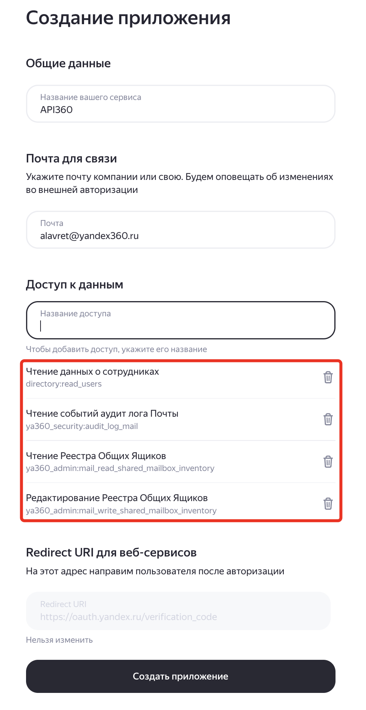
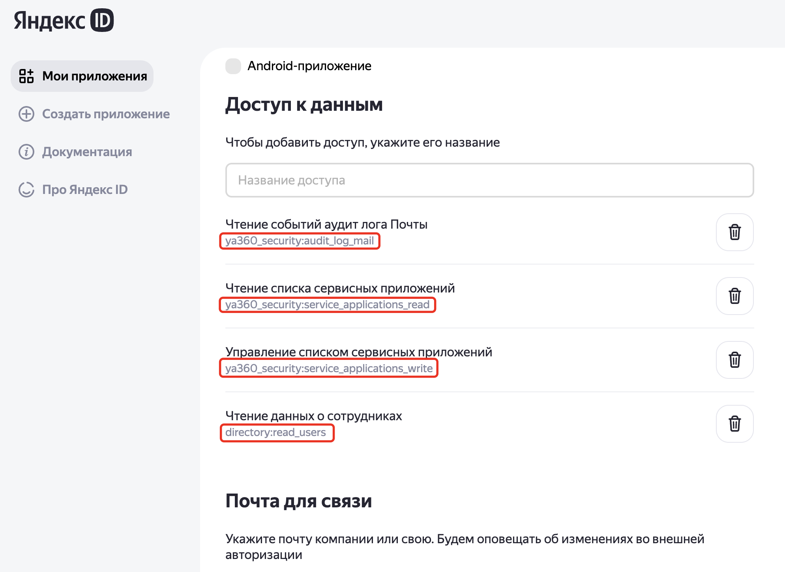

# Выгрузка заголовков сообщений из IMAP почтового ящика Яндекс 360

## Содержание

- [Обзор](#обзор)
- [Параметры](#параметры)
- [Режимы работы скрипта](#режимы-работы-скрипта)
- [Форматы файлов](#форматы-файлов)
- [Отчётность](#отчётность)
- [Фильтрация при сравнении](#фильтрация-при-сравнении)
- [Сценарии использования](#сценарии-использования)
- [Пошаговая инструкция по сравнению почтовых ящиков](#пошаговая-инструкция-по-сравнению-почтовых-ящиков)
- [Установка](#установка)
- [Логирование](#логирование)

## Обзор

Скрипт `imap_helper.py` предназначен для выгрузки заголовков электронных писем из IMAP почтовых ящиков Яндекс 360 и последующего сравнения содержимого ящиков между различными почтовыми системами.

Основная задача — получить полный перечень сообщений (заголовки) из IMAP-ящика в Яндекс 360, сохранить его в структурированном CSV-файле и затем сопоставить с аналогичным списком из исходной почтовой системы. Это позволяет находить расхождения в содержимом почтовых ящиков после частичной или полной миграции сообщений из одной системы в другую — например, выявить письма, которые не были перенесены, были потеряны или задублированы в процессе миграции.

### Ключевые возможности

- **Выгрузка заголовков сообщений** — подключение к IMAP-ящику, обход всех папок и сохранение метаданных каждого сообщения (дата, отправитель, тема, Message-ID, размер, папка) в CSV-файл
- **Сравнение почтовых ящиков** — автоматическое сопоставление списков сообщений из исходного и целевого ящиков по полю Message-ID с формированием отчёта о расхождениях
- **Гибкая фильтрация** — возможность исключить из сравнения определённые сообщения по теме, отправителю, папке или размеру с помощью файла правил
- **Фильтрация по дате** — ограничение диапазона дат сообщений, участвующих в сравнении
- **Многопоточная обработка** — параллельное подключение к нескольким ящикам для ускорения выгрузки
- **Детальная отчётность** — статусный отчёт по каждому обработанному ящику и сводный отчёт по результатам сравнения
- **Поддержка общих и делегированных ящиков** — работа как с пользовательскими, так и с общими почтовыми ящиками организации
- **Checkpoint система** — сохранение и восстановление состояния делегирования почтовых ящиков

## Параметры

Скрипт использует переменные окружения, которые задаются в файле `.env` в каталоге скрипта:

| Имя параметра | Описание | Обязательный | Пример значения |
|---|---|---|---|
| `OAUTH_TOKEN_ARG` | OAuth-токен для аутентификации в API Yandex 360 | Да | `y0_AgAAAA...` |
| `ORGANIZATION_ID_ARG` | Идентификатор организации в Yandex 360 | Да | `123456` |
| `APPLICATION_CLIENT_ID_ARG` | ID сервисного приложения (OAuth) | Зависит от `RUN_MODE` | `f1e4386f276643` |
| `APPLICATION_CLIENT_SECRET_ARG` | Секрет сервисного приложения | Зависит от `RUN_MODE` | `333bf50d7a8` |
| `DELEGATE_ALIAS` | Логин делегата (без домена) | Зависит от `RUN_MODE` | `i.petrov` |
| `DELEGATE_DOMAIN` | Домен организации | Зависит от `RUN_MODE` | `example.ru` |
| `DELEGATE_PASSWORD` | Пароль приложения для доступа делегата к IMAP | Зависит от `RUN_MODE` | `app_password_here` |
| `RUN_MODE` | Режим запуска: `delegate`, `service_application` или `hybrid` | Да | `hybrid` |
| `MAILBOXES_LIST_FILE` | Файл со списком почтовых ящиков для обработки | Нет (по умолчанию `mailboxes.csv`) | `mailboxes.csv` |
| `IMAP_MESSAGES_FOLDER` | Каталог для сохранения выгруженных CSV-файлов с сообщениями | Нет (по умолчанию `imap_messages`) | `imap_messages` |
| `CHECK_DIR` | Каталог для хранения checkpoint-файлов | Нет (по умолчанию `mailbox_checkpoints`) | `mailbox_checkpoints` |
| `REPORTS_DIR` | Каталог для файлов отчёта | Нет (по умолчанию `reports`) | `reports` |
| `COMAPARE_FOLDER` | Корневой каталог для циклов сравнения | Нет (по умолчанию пустая строка) | `compare` |
| `COMAPARE_SOURCE_FOLDER` | Имя подпапки для сообщений из исходного ящика | Нет | `a` |
| `COMAPARE_DESTINATION_FOLDER` | Имя подпапки для сообщений из целевого ящика | Нет | `b` |
| `COMAPARE_RESULT_FOLDER` | Имя подпапки для результатов сравнения | Нет | `result` |
| `SERVICE_APP_API_DATA_FILE` | Файл для выгрузки данных сервисного приложения | Нет (по умолчанию `service_api_data.txt`) | `service_api_data.txt` |

### Пример файла `.env`

```
OAUTH_TOKEN_ARG = y0_AgAAAA...
ORGANIZATION_ID_ARG = 1234567

APPLICATION_CLIENT_ID_ARG = f1e4386f27664
APPLICATION_CLIENT_SECRET_ARG = 333bf50d7a

RUN_MODE = hybrid

DELEGATE_ALIAS = delegate
DELEGATE_DOMAIN = domain.ru
DELEGATE_PASSWORD = qeqnpvatac

MAILBOXES_LIST_FILE = mailboxes.csv
IMAP_MESSAGES_FOLDER = imap_messages
CHECK_DIR = mailbox_checkpoints
REPORTS_DIR = reports

COMAPARE_FOLDER = compare
COMAPARE_SOURCE_FOLDER = a
COMAPARE_DESTINATION_FOLDER = b
COMAPARE_RESULT_FOLDER = result
```

## Режимы работы скрипта

Скрипт поддерживает три режима аутентификации в IMAP, задаваемых параметром `RUN_MODE`:

| Режим | Описание | Необходимые параметры |
|---|---|---|
| `delegate` | Подключение через делегированную учётную запись | `DELEGATE_ALIAS`, `DELEGATE_DOMAIN`, `DELEGATE_PASSWORD` |
| `service_application` | Подключение через токены сервисного приложения | `APPLICATION_CLIENT_ID_ARG`, `APPLICATION_CLIENT_SECRET_ARG` |
| `hybrid` | Комбинированный режим (оба способа) | Все параметры выше |

Режим `delegate` позволяет работать с общими ящиками и заблокированными аккаунтами. Режим `service_application` работает быстрее (не требуется добавление/удаление делегата). Режим `hybrid` автоматически выбирает оптимальный способ подключения.

## Требования к запуску скрипта со стороны Яндекс 360 API
Для работы скрипта необходимо:
1. Получить токен OAuth для чтения данных организации Яндекс 360 через API.

### Получение токена OAuth для работы с данными Яндекс 360

1. Для работы приложения необходимо сгенериовать OAuth токен для аутентификации в API Яндекс 360. Токен должен содержать необходимые права для выполения операций управления ресурсами в организации Яндекс 360. Документация - [Создание приложения](https://yandex.ru/dev/id/doc/ru/register-client). Последовательность шагов для создания токена:
    * заходим на https://oauth.yandex.ru/client/new/. Аутентифицируемся от имени администратора организации Яндекс 360.
    * Заполняем поля в форме создания приложения:
        - Поле "Название вашего сервиса" - произвольное название.
        - Включаем галочку "Веб сервисы"
        - В поле `Redirect URL` вводим `https://oauth.yandex.ru/verification_code`
        - В разделе "Почта для связи" указываем свой email.
          
        
        
    * Добавляем разрешения для токена. Для этого в разделе "Доступ к данным" ищем и добавляем следующие разрешения:
        | Имя разрешения | Что можно делать |
        |----------------|----------|
        | directory:read_users |  читать информацию о пользователях |
        | ya360_admin:mail_read_shared_mailbox_inventory | листинг делегирования ящика и чтение общих ящиков |
        | ya360_admin:mail_write_shared_mailbox_inventory | управление делегированием почтовых ящиков |
        | (опционально) ya360_security:service_applications_read | чтение  сервисных приложений (для режима `hybrid`) |
        | (опционально) ya360_security:service_applications_write | запись  сервисных приложений (для режима `hybrid`) |
        
        
        
    * нажимаем на кнопку "Создать приложение".
    * Свойства созданного приложения отображаются в новом окне "Мои приложения". Ищем раздел с идентификатором созданного приложения и копируем строку из поля "ClientID":
      
        
        
    * В текстовом редакторе созадем строку вида `https://oauth.yandex.ru/authorize?response_type=token&client_id=<идентификатор приложения>` и вставляем в ней вместо `<идентификатор приложения>` скопированное значение ClientID из предыдущего пункта. 
    Вставляем получившуюся ссылку в браузер и нажимаем "Enter".
    
> [!WARNING]  
> Копируем токен и сохраняем в надёжном месте.

2. Получить ID организации в Яндекс 360. Для этого необходимо зайти в [консоль администрирования](admin.yandex.ru) и в левом нижнем углу интерфейса будет необходимый номер.
   
   
        
3. Записываем полученные на предыдущем шаге OAuth токен и Org ID в соответствующие переменные в файле файле `.env` в том же каталоге, что и сами скрипты. Эта информация нужна для правильной аутентификации скриптов в API Яндекс 360.

### Создание сервисного приложения
Для работы скрипта через сервисное приложение (`RUN_MODE` = `hybrid`) необходимо наличие в правах основного токена прав:

 - ya360_security:service_applications_read 
 - ya360_security:service_applications_wwrite
 
После этого необходимо создать ещё одно OAuth приложение, шаги по созданию аналогичны шагам создания основного приложения. Но при указании доступных разрешений нужно указать:

 - mail:imap_full

После сохранения приложения нужно скопировать его Application ID и APPLICATION Secret, которые необходимо записать в соответствующие параметры в конфигурационном файле (`APPLICATION_CLIENT_ID_ARG`, `APPLICATION_CLIENT_SECRET_ARG`).

> [!WARNING]  
> Для корректной настройки сервисного приложения токен основного приложения необходимо выписывать от имени учётки-владельца организации (в домене `@yandex.ru`).

При первом запуске скрипта необходимо перейти в пункт меню `4. Проверить/настроить сервисное приложение для удаления сообщений.` и затем выбрать `2. Настроить сервисное приложение.`. Это корректно настроит сервисное приложение для работы скрипта.

## Форматы файлов

### Входные файлы

#### Файл списка почтовых ящиков (`mailboxes.csv`)

Текстовый файл, в котором первая строка содержит заголовок `email`, а последующие строки — идентификаторы почтовых ящиков. Допускается указание nickname (без домена), полного email или UID пользователя.

Пример:
```
email
ivanov
petrov@domain.ru
12923487329847
```

#### Файл правил фильтрации (`filter_rules.txt`)

Текстовый файл с правилами исключения сообщений из сравнения. Строки, начинающиеся с `#`, являются комментариями. Подробнее — в разделе [Фильтрация при сравнении](#фильтрация-при-сравнении).

#### CSV-файл сообщений из исходной почтовой системы

CSV-файл с разделителем `;`, содержащий заголовки сообщений из исходного почтового ящика (например, выгруженных из Exchange, Zimbra и т.д.). Формат файла должен соответствовать формату выходного CSV-файла скрипта. Т.е. в файле должны быть такие заголовки:
```
nn;folder;date;from;subject;message-id;size
```

### Выходные файлы

#### CSV-файл с заголовками сообщений

При выгрузке сообщений из IMAP-ящика скрипт создаёт CSV-файл (разделитель `;`) в каталоге `IMAP_MESSAGES_FOLDER`. Имя файла формируется по шаблону `<alias>_<YYYYMMDD_HHMMSS>.csv`.

Пример содержимого:
```
nn;folder;date;from;subject;message-id;size
1;INBOX;Mon, 15 Jan 2024 10:30:00 +0300;Ivan Petrov <i.petrov@domain.ru>;Отчёт за январь;<msg001@domain.ru>;15234
2;INBOX;Tue, 16 Jan 2024 14:00:00 +0300;Anna Sidorova <a.sidorova@domain.ru>;Re: Отчёт за январь;<msg002@domain.ru>;8921
3;Sent;Mon, 15 Jan 2024 11:00:00 +0300;User <user@domain.ru>;Fw: Документы;<msg003@domain.ru>;102400
```

Описание полей:

| Поле | Описание |
|---|---|
| `nn` | Порядковый номер сообщения (сквозная нумерация по всем папкам) |
| `folder` | Имя IMAP-папки, в которой находится сообщение (например, `INBOX`, `Sent`, `Drafts`) |
| `date` | Дата и время сообщения из заголовка `Date` |
| `from` | Отправитель сообщения из заголовка `From` |
| `subject` | Тема сообщения из заголовка `Subject` |
| `message-id` | Уникальный идентификатор сообщения из заголовка `Message-ID` |
| `size` | Размер сообщения в байтах |

#### Статусный отчёт о выгрузке (`get_messages_status_<timestamp>.csv`)

Создаётся в каталоге `REPORTS_DIR`. Содержит информацию о результате обработки каждого ящика.

Пример содержимого:
```
thread_id;date;email;mailbox_type;status;messages_count;error
1;2024-01-20 10:30:00;ivanov@domain.ru;user_mailbox;success;1523;
2;2024-01-20 10:30:15;petrov@domain.ru;user_mailbox;success;842;
3;2024-01-20 10:30:20;shared-box@domain.ru;shared_mailbox;success;310;
```

Описание полей:

| Поле | Описание |
|---|---|
| `thread_id` | Идентификатор потока, обработавшего ящик |
| `date` | Дата и время завершения обработки ящика |
| `email` | Email обработанного ящика |
| `mailbox_type` | Тип ящика (`user_mailbox` или `shared_mailbox`) |
| `status` | Результат обработки (`success` или `error`) |
| `messages_count` | Количество сообщений в ящике |
| `error` | Описание ошибки (если `status = error`) |

#### Результирующий файл сравнения (`_result_<timestamp>.csv`)

Создаётся в подпапке `result` каталога сравнения. Содержит сводную информацию по каждому ящику.

Пример содержимого:
```
alias;source;dest;source_count;dest_count;missed_count
ivanov;ivanov_20240120_103000.csv;ivanov_20240121_140000.csv;1523;1520;3
petrov;petrov_20240120_103015.csv;petrov_20240121_140100.csv;842;842;0
sidorova;sidorova_20240120_103020.csv;;310;0;310
```

Описание полей:

| Поле | Описание |
|---|---|
| `alias` | Алиас (nickname) почтового ящика |
| `source` | Имя CSV-файла из каталога источника |
| `dest` | Имя CSV-файла из каталога назначения (пустое, если пара не найдена) |
| `source_count` | Количество сообщений в источнике (после фильтрации) |
| `dest_count` | Количество сообщений в назначении |
| `missed_count` | Количество сообщений из источника, не найденных в назначении |

#### Файл расхождений (`<alias>_diff_<timestamp>.csv`)

Создаётся для каждого ящика, в котором обнаружены расхождения. Формат совпадает с CSV-файлом сообщений и содержит только те сообщения из источника, которые не были найдены в назначении.

#### Файл параметров фильтрации (`_compare_filters_<timestamp>.txt`)

Текстовый файл, который сохраняется в папке `result` при каждом запуске сравнения. Содержит зафиксированные параметры: каталоги сравнения, диапазон дат, правила фильтрации. Служит для воспроизводимости и аудита результатов.

## Отчётность

### Отчёт о выгрузке сообщений

После завершения выгрузки скрипт выводит в консоль финальный отчёт:

```
====================================================================================================
ФИНАЛЬНЫЙ ОТЧЕТ О ЧТЕНИИ ПОЧТОВЫХ ЯЩИКОВ
====================================================================================================

УСПЕШНО ОБРАБОТАННЫЕ ЯЩИКИ:
  ivanov: 1523 сообщений
  petrov: 842 сообщений

Ошибки при обработке:
  - shared-box: Connection timeout

----------------------------------------------------------------------------------------------------
ИТОГОВАЯ СТАТИСТИКА:
  Всего почтовых ящиков: 3
  Успешно обработано: 2
  Пропущено ящиков: 0
  Ошибок при обработке: 1
  Всего получено сообщений: 2365
====================================================================================================
```

Дополнительно результаты сохраняются в CSV-файл `get_messages_status_<timestamp>.csv` в каталоге `REPORTS_DIR`.

### Отчёт о сравнении

После завершения сравнения скрипт выводит в консоль сводку:

```
============================================================
  Результаты сравнения
============================================================
  ivanov: не найдено: 3
  petrov: не найдено: 0
  sidorova: НЕТ ПАРЫ
------------------------------------------------------------
  Всего алиасов: 3, всего не найдено сообщений: 313
  Результаты сохранены в: compare/cycle1/result/_result_20240121_150000.csv
============================================================
```

Для каждого ящика с расхождениями создаётся отдельный CSV-файл с перечнем отсутствующих сообщений.

## Фильтрация при сравнении

При сравнении содержимого почтовых ящиков можно исключить определённые сообщения, чтобы они не учитывались как расхождения. Правила фильтрации задаются в файле `filter_rules.txt`.

### Формат правил

```
field = pattern     — для текстовых полей
field > number      — для поля size (больше)
field < number      — для поля size (меньше)
```

### Поддерживаемые поля

| Поле | Тип | Описание |
|---|---|---|
| `subject` | текст | Тема письма |
| `from` | текст | Отправитель (для email-адресов извлекается часть внутри `< >`) |
| `folder` | текст | Имя IMAP-папки |
| `size` | число | Размер сообщения в байтах |

### Подстановочные символы для текстовых полей

| Шаблон | Описание |
|---|---|
| `текст*` | Значение начинается на `текст` |
| `*текст` | Значение заканчивается на `текст` |
| `*текст*` | Значение содержит `текст` |
| `текст` | Точное совпадение |

### Суффиксы размера

| Суффикс | Описание |
|---|---|
| `K` или `К` | Килобайты (×1024) |
| `M` или `М` | Мегабайты (×1024×1024) |
| без суффикса | Байты |

### Примеры правил

```
# Исключить уведомления календаря
from = info@calendar.yandex.ru

# Исключить письма с темой, начинающейся на "Retrieval using the IMAP4"
subject = Retrieval using the IMAP4*

# Исключить все письма из папки Drafts
folder = Drafts

# Исключить все сообщения с домена mail.ru
from = *@mail.ru

# Исключить сообщения больше 5 МБ
size > 5M

# Исключить сообщения меньше 100 КБ
size < 100K
```

### Логика работы фильтрации

Сообщение исключается из сравнения, если оно подпадает хотя бы под одно правило. Правила применяются к файлу источника при чтении. Таким образом, отфильтрованные сообщения не учитываются при подсчёте расхождений.

Дополнительно при каждом запуске сравнения поддерживается фильтрация по диапазону дат — скрипт запрашивает начальную и конечную дату, и в сравнение попадают только сообщения, дата которых входит в указанный диапазон.

Сообщения с пустым `message-id` по умолчанию пропускаются (не учитываются как расхождения), так как их невозможно однозначно сопоставить.

## Сценарии использования

### Сценарий 1: Выгрузка сообщений из IMAP-ящиков Яндекс 360

**Задача:** Получить список всех сообщений из почтовых ящиков нескольких пользователей для последующего сравнения.

1. Заполните файл `mailboxes.csv` списком пользователей.
2. Запустите скрипт:
   ```bash
   python imap_helper.py
   ```
3. Выберите пункт меню `1. Выгрузить список сообщений почтового ящика для пользователей.`
4. Укажите пользователей (из файла или вручную).
5. Скрипт подключится к каждому ящику, выгрузит заголовки всех сообщений и сохранит их в CSV-файлы в каталоге `IMAP_MESSAGES_FOLDER`.

### Сценарий 2: Сравнение содержимого ящиков после миграции

**Задача:** Найти сообщения, которые не были перенесены из исходной почтовой системы в Яндекс 360.

1. Подготовьте структуру каталогов для сравнения (подробнее — в разделе [Пошаговая инструкция](#пошаговая-инструкция-по-сравнению-почтовых-ящиков)).
2. Запустите скрипт и выберите пункт меню `2. Сравнить содержимое почтовых ящиков.`
3. Выберите каталог цикла сравнения.
4. Укажите диапазон дат (или `*` для всех дат).
5. Скрипт выполнит сравнение и создаст файлы расхождений для каждого ящика, где обнаружены отсутствующие сообщения.

### Сценарий 3: Сравнение с фильтрацией

**Задача:** При сравнении исключить служебные уведомления и письма из определённых папок.

1. Создайте или отредактируйте файл `filter_rules.txt`:
   ```
   from = info@calendar.yandex.ru
   folder = Drafts
   subject = Retrieval using the IMAP4*
   ```
2. Запустите сравнение (пункт меню `2`).
3. Сообщения, подпадающие под правила, будут автоматически исключены из сравнения.

### Сценарий 4: Восстановление настроек делегирования

**Задача:** Восстановить исходные права доступа к ящикам после сбоя.

1. Запустите скрипт и выберите пункт меню `3. Восстановить конфигурацию почтовых ящиков из файла checkin.`
2. Скрипт найдёт последний checkpoint-файл и предложит восстановить настройки делегирования.

## Пошаговая инструкция по сравнению почтовых ящиков

Ниже описан полный процесс сравнения содержимого почтовых ящиков в исходной системе и в Яндекс 360 — от подготовки данных до интерпретации результатов.

### Предпосылки

У вас уже есть список сообщений из исходной почтовой системы (например, Exchange, Zimbra, другой IMAP-сервер) в формате CSV с разделителем `;` и заголовками `nn;folder;date;from;subject;message-id;size`. Этот файл может быть получен с помощью аналогичного инструмента для исходной системы или экспортирован из неё другим способом.

### Шаг 1. Настройка окружения

1. Установите зависимости:
   ```bash
   pip install -r requirements.txt
   ```
2. Создайте файл `.env` в каталоге скрипта и заполните его обязательные параметры (`OAUTH_TOKEN_ARG`, `ORGANIZATION_ID_ARG`, `RUN_MODE`) и параметры подключения к IMAP (`DELEGATE_ALIAS`, `DELEGATE_DOMAIN`, `DELEGATE_PASSWORD` и/или `APPLICATION_CLIENT_ID_ARG`, `APPLICATION_CLIENT_SECRET_ARG` в зависимости от `RUN_MODE`).
3. В каталоге COMAPARE_FOLDER (по умолчению `compare` в каталоге со скриптом) создайте отдельный каталог для запуска процедуры сравнения (например, `mig_01`). Внутри этого каталога создайте папки `COMAPARE_SOURCE_FOLDER` (в приведённом примере папка `a`) и `COMAPARE_DESTINATION_FOLDER` (в приведённом примере папка `b`):
   ```
   IMAP_MESSAGES_FOLDER = imap_messages
   COMAPARE_FOLDER = compare
   COMAPARE_SOURCE_FOLDER = a
   COMAPARE_DESTINATION_FOLDER = b
   COMAPARE_RESULT_FOLDER = result
   ```
В итоге структура каталога будет такой:
```
compare/
└── mig_01/                  # имя цикла сравнения (например, mig_01)
    ├── a/                   # COMAPARE_SOURCE_FOLDER — исходные сообщения (например, из Exchange)
    ├── b/                   # COMAPARE_DESTINATION_FOLDER — сообщения из Яндекс 360
    └── result/              # COMAPARE_RESULT_FOLDER — результаты сравнения (создаётся автоматически)
```
Или в терминале:
```bash
mkdir -p compare/mig_01/a compare/mig_01/b
```

Структура после размещения файлов будет выглядеть так:
```
compare/
└── mig_01/
    ├── a/
    │   ├── ivanov_20240115_120000.csv
    │   ├── petrov_20240115_130000.csv
    │   └── sidorova_20240115_140000.csv
    ├── b/
    │   ├── ivanov_20240120_103000.csv
    │   ├── petrov_20240120_103015.csv
    │   └── sidorova_20240120_103020.csv
    └── result/
```

### Шаг 2. Подготовка списка пользователей

Создайте файл `mailboxes.csv` со списком почтовых ящиков, которые нужно проверить:

```
email
ivanov
petrov
sidorova
```

### Шаг 3. Выгрузка сообщений из IMAP-ящиков Яндекс 360

1. Запустите скрипт:
   ```bash
   python imap_helper.py
   ```
2. Выберите пункт `1. Выгрузить список сообщений почтового ящика для пользователей.`
3. Укажите пользователей из файла `mailboxes.csv` или введите вручную.
4. Дождитесь завершения. Для каждого ящика в каталоге `imap_messages/` будет создан CSV-файл вида `ivanov_20240120_103000.csv`.

### Шаг 4 (ещё раз, если пропустили шаг создания каталогов). Формирование структуры каталогов для сравнения

Создайте структуру каталогов для цикла сравнения. Каждый цикл — это отдельная папка внутри `COMAPARE_FOLDER`:

```
compare/
└── mig_01/              ← имя цикла сравнения (произвольное)
    ├── a/               ← COMAPARE_SOURCE_FOLDER (исходные файлы)
    ├── b/               ← COMAPARE_DESTINATION_FOLDER (файлы из Я360)
    └── result/          ← COMAPARE_RESULT_FOLDER (создаётся автоматически)
```

Создать каталоги можно командой:
```bash
mkdir -p compare/cycle1/a compare/cycle1/b
```

### Шаг 5. Размещение файлов в каталогах

1. **Папка `a/` (источник)** — скопируйте сюда CSV-файлы с сообщениями из исходной почтовой системы. Имя файла должно содержать алиас пользователя (например, `ivanov_20240115_120000.csv` или `ivanov.csv`).

2. **Папка `b/` (назначение)** — скопируйте сюда CSV-файлы, выгруженные из Яндекс 360 на Шаге 3 (из каталога `imap_messages/`):
   ```bash
   cp imap_messages/ivanov_20240120_103000.csv compare/mig_01/b/
   cp imap_messages/petrov_20240120_103015.csv compare/mig_01/b/
   cp imap_messages/sidorova_20240120_103020.csv compare/mig_01/b/
   ```

> **Важно:** Скрипт сопоставляет файлы по алиасу (часть имени файла до `@` или до метки времени). Файлы `ivanov_20240115_120000.csv` в папке `a/` и `ivanov_20240120_103000.csv` в папке `b/` будут сопоставлены, так как алиас `ivanov` совпадает. Если для одного алиаса есть несколько файлов, выбирается файл с самой поздней меткой времени.

### Шаг 6. Настройка фильтрации (необязательно)

Если нужно исключить определённые типы сообщений из сравнения, отредактируйте файл `filter_rules.txt`:

```
# Исключить уведомления календаря
from = info@calendar.yandex.ru

# Исключить сервисные сообщения
subject = Retrieval using the IMAP4*
```

### Шаг 7. Запуск сравнения

1. Запустите скрипт:
   ```bash
   python imap_helper.py
   ```
2. Выберите пункт `2. Сравнить содержимое почтовых ящиков.`
3. Выберите каталог цикла сравнения (например, `mig_01`).
4. Введите диапазон дат для сравнения:
   - `*` — все даты (без ограничений)
   - `01.01.2024 - 31.12.2024` — конкретный диапазон
   - `* - 31.12.2024` — все сообщения до указанной даты
   - Enter — выход в меню

### Шаг 8. Интерпретация результатов

После завершения сравнения в каталоге `compare/mig_01/result/` появятся следующие файлы:

1. **`_result_<timestamp>.csv`** — сводная таблица по всем ящикам. Содержит для каждого алиаса количество сообщений в источнике, в назначении и количество не найденных. Если значение `missed_count = 0`, все сообщения источника присутствуют в назначении.

2. **`<alias>_diff_<timestamp>.csv`** — создаётся для каждого ящика, где есть расхождения. Содержит полный список сообщений из источника, которые не были найдены в назначении. Этот файл можно использовать для ручного анализа или повторной миграции отсутствующих сообщений.

3. **`_compare_filters_<timestamp>.txt`** — файл с зафиксированными параметрами сравнения (каталоги, диапазон дат, правила фильтрации). Позволяет воспроизвести сравнение с теми же параметрами.

**Как читать результаты:**

- `missed_count = 0` — все сообщения из источника найдены в назначении, миграция прошла полностью
- `missed_count > 0` — указанное количество сообщений из источника отсутствует в назначении; детали — в файле `<alias>_diff_<timestamp>.csv`
- `НЕТ ПАРЫ` — для данного алиаса нет соответствующего файла в каталоге назначения; возможно, ящик не был обработан или файл не был скопирован

### Шаг 9. Действия по результатам

- Откройте файл `_result_<timestamp>.csv` и найдите ящики с `missed_count > 0`.
- Для каждого такого ящика откройте соответствующий `<alias>_diff_<timestamp>.csv` и изучите список отсутствующих сообщений.
- При необходимости скорректируйте фильтрацию (если часть «расхождений» — это ожидаемо отсутствующие сообщения, например, уведомления календаря) и повторите сравнение.
- Используйте список отсутствующих сообщений для целевого досыла или повторной миграции.

## Установка

### Системные требования

- **Python**: версия 3.9 или выше
- **Операционная система**: Linux, macOS, Windows
- **Сеть**: доступ к `api360.yandex.net`, `oauth.yandex.ru`, `imap.yandex.ru`

### Установка зависимостей

```bash
pip install -r requirements.txt
```

## Логирование

- **Консоль**: сообщения уровня INFO с временными метками (формат: `HH:MM:SS INFO: Сообщение`)
- **Файл**: сообщения уровня DEBUG записываются в `imap_helper.log`, ротация при достижении 10 МБ (хранится 5 резервных копий)
